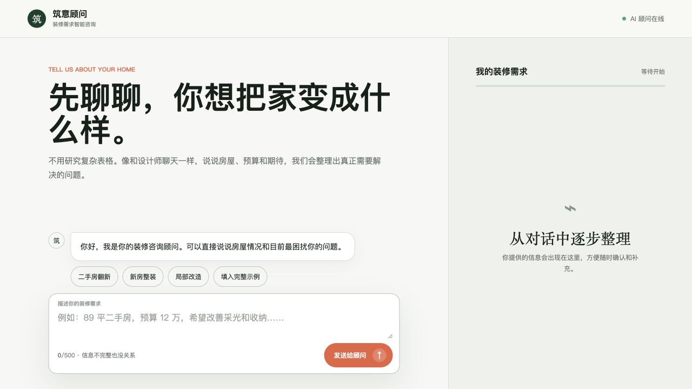
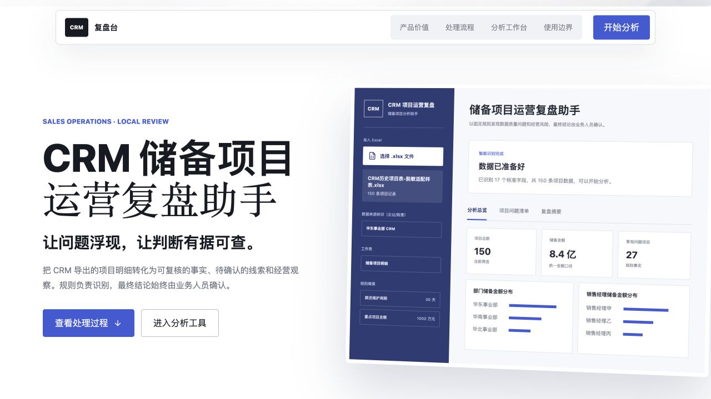

# Kang Frontend Standard

> 让 AI 做前端时，不再只是“能运行”，而是先判断、再设计、再验证。

一套面向 AI 编程助手的通用前端设计与交付标准。它适用于首次开发、重构、二次开发和持续迭代，不限定 React、页面类型、业务领域、字体、配色或固定页面结构。

## 快速开始

~~~bash
npx skills add KanG-ciyuan/kang-frontend-standard
~~~

验证公开 Skill 是否可发现：

~~~bash
npx skills add KanG-ciyuan/kang-frontend-standard --list
~~~

安装后，在前端任务中直接说：

~~~text
Use $kang-frontend-standard to design and deliver this frontend.
~~~

或者用中文描述任务：

~~~text
先识别这个页面的产品类型和用户任务，再参考成熟的前端设计，给我 3 套全尺寸视觉方向。我选定后再实现，并在浏览器里检查最终状态。
~~~

当前版本：`v0.5.0` · MIT License

## 为什么需要它

AI 生成前端最常见的问题，不是页面无法运行，而是设计决策太快、审美过早收敛、动效缺少目的、参考来源没有核实，最后也没有足够的浏览器证据支持交付。

这个 Skill 把前端工作拆成一条可以重复执行的路径：先理解产品和用户，再建立适合当前任务的视觉判断；需要时检查成熟的开源设计系统和组件；完成实现后，检查静态终态、真实交互、响应、无障碍、性能、测试和部署边界。

它不会把每个页面变成同一种风格，也不会把某个框架、字体、颜色或布局写死。视觉系统应当由产品目的、内容、用户、现有代码和可验证参考共同决定。

## 没有 Skill 与使用 Skill

| 没有 Skill | 使用 `kang-frontend-standard` |
|---|---|
| 直接开始写页面 | 先识别页面类型、用户任务、内容层级和主要动作 |
| 依赖模型默认审美 | 检查成熟参考，并说明实际借鉴了哪些结构或交互质量 |
| 动效只是旋转、漂浮或循环装饰 | 动效对应状态、层级、反馈、进度或叙事节奏 |
| 截图能打开就交付 | 等待字体、数据和入口动效稳定，再检查完整页面和关键流程 |
| 重构等于推翻原版 | 评估原版有效部分，按保留、采纳、继续修改、拒绝选择性迭代 |
| 本地能跑就当成生产完成 | 区分概念、原型、本地验证、预览部署和生产能力 |

## 真实案例证据

下面的图片来自本地真实渲染和评审，不代表生产部署、客户采用或普遍的视觉优越性。

### 装修咨询入口

**证据级别：`tested locally`**

这个页面面向装修客户，重点是降低输入门槛，让客户先描述房屋、预算和期望，再由后续流程提取线索、生成建议回复和进行意向判断。Skill 的作用集中在页面层级、输入状态、信息节奏、稳定截图和交互检查，而不是替业务规则做决定。

### CRM 案例界面

**证据级别：`prototype`**

这个界面用于展示业务数据分析流程、结果解释和人工确认边界。它用来检查信息层级、页面节奏、内容密度和案例叙事方式；它是本地原型证据，不等于线上产品能力。

更多素材的证据级别和来源说明见 [`docs/assets/cases/README.md`](docs/assets/cases/README.md)。

## 它会做什么

1. **识别任务**：读取页面、代码、内容和运行方式，判断用户任务、信息层级、关键状态、设备范围和交付边界。
2. **展开视觉方向**：大型首次设计、重大重构或方向不清时，先做 1-6 套全尺寸方向；小型页面可以压缩为 1-3 套。
3. **检查成熟参考**：检查开源组件库、设计系统、官方文档或项目内已有组件，记录实际借鉴到的质量。
4. **建立视觉系统**：根据产品目的、内容和代码环境决定字体层级、颜色角色、间距、组件、令牌和动效节奏。
5. **设计有意义的动效**：动效服务于状态、反馈、层级、空间关系或阅读节奏，不使用无目的的无限旋转和漂浮。
6. **完成工程检查**：检查语义、键盘、焦点、对比度、响应、状态、性能、浏览器、构建和部署边界。

外部参考无法访问时，会按官方仓库、文档、组件故事页、同类成熟案例和本地已验证资源逐级降级；仍无法核实时，明确标记为原创探索。

## 能力矩阵

| 能力 | 你会得到什么 |
|---|---|
| 视觉方向 | 在大幅设计前，用可比较的全尺寸方向降低抽卡式决策 |
| 成熟参考 | 通过真实检查借鉴结构、组件和交互质量，避免无依据造轮子 |
| 选择性优化 | 保留原版有效部分，只采纳真正改善任务和可信度的改动 |
| 字体与层级 | 根据语言、内容和产品任务建立舒适、清晰的类型系统 |
| 组件与 Token | 让重复的颜色、间距、圆角、阴影、断点和动效时序保持一致 |
| 动效 | 为状态、反馈、空间关系和阅读节奏设计有目的的动态行为 |
| 响应式与无障碍 | 检查窄屏、换行、触控目标、键盘、焦点、标签和对比度 |
| 性能与交付 | 控制资源成本，区分本地、预览和生产环境并记录回归检查 |

## 你可以这样说

- “这是一个新产品需求。先识别用户任务，再给我 3 套全尺寸视觉方向，确认后实现。”
- “这是一个已有页面。请保留可用部分，检查成熟参考，只做能被对比证明的改动。”
- “参考成熟的开源组件和设计系统，但不要复制品牌和 Logo，并记录实际借鉴了什么。”
- “这个页面的动效太低级了。请重新设计有明确目的的交互和滚动节奏，并在浏览器里验证。”
- “请检查这个前端的字体、结构、响应式、无障碍、性能、测试和部署边界，先给问题再改。”

## 前置条件

- [ ] AI 编程助手支持 `SKILL.md` 类型的 Skill。
- [ ] 已安装 Node.js 和 `npx`，可用 `node --version` 与 `npx --version` 检查。
- [ ] 需要浏览器评审时，项目能启动本地预览服务，或已有可访问的预览地址。
- [ ] 需要外部参考时，允许访问公开文档、仓库或组件页面；访问失败时保留证据缺口。

这个 Skill 不需要 API Key。若项目本身需要 API、部署平台或外部数据服务，密钥只能放在后端环境变量中，不得写入 README、前端包或 Git。

## Troubleshooting

| 现象 | 可能原因 | 处理方式 |
|---|---|---|
| `No valid skills found` | 根目录没有可发现的 `SKILL.md` 或 frontmatter 不完整 | 从仓库根目录安装，并检查 `SKILL.md` 的 `name` 与 `description` |
| `npx skills add` 找不到仓库 | 网络、仓库地址或公开发现状态异常 | 运行 `npx skills add KanG-ciyuan/kang-frontend-standard --list` 后再检查仓库状态 |
| 本地浏览器打不开预览 | 服务已退出、端口变化或打开了旧的 `file://` 页面 | 重新启动预览服务，使用服务输出的 `http://localhost:<port>` 地址 |
| 外部成熟设计无法访问 | 站点、仓库或网络通道不可用 | 按降级顺序寻找可核实来源，并标记未核实部分 |
| 截图中文字或布局不稳定 | 字体、数据或入口动效还没完成 | 等待稳定状态后再截图；动效质量另行检查 |
| 本地页面通过检查 | 本地验证不代表预览或生产环境可用 | 记录环境、浏览器、服务依赖、性能测量类型和未验证项 |

## 证据和边界

- `tested locally`：已在本地浏览器中按指定视口和状态检查过。
- `prototype`：可运行的原型，用于检查结构、交互或视觉方向。
- `simulated`：模拟输入或流程，不等于真实业务接入。
- `to verify`：当前没有足够证据，不包装成已完成。

这个 Skill 提供可重复的判断与交付流程，不保证任何模型在所有项目中自动产出惊艳页面。最终质量取决于模型能力、产品目标、内容素材、参考可用性、实现环境和用户反馈。

## 版本

### v0.5.0

- 加入选择性优化规则，避免不必要的整页推翻。
- 加入公平的完整页面前后对比要求。
- 加入外部参考不可访问时的明确降级流程。
- 加入成熟参考、动效、响应式、无障碍、性能、测试与部署边界。
- 通过装修咨询入口和 CRM 案例界面的本地验证。

## 作者

**Kang** 创建、维护并发布 `Kang Frontend Standard`。

## English

`Kang Frontend Standard` is a general frontend design and delivery standard for AI coding agents.

> Move AI frontend work beyond “it runs”: identify the product, design with intent, and verify the result.

It applies to first-time builds, redesigns, refactors, and continued iteration without prescribing React, a page category, a font, a palette, or a fixed layout.

### Install

~~~bash
npx skills add KanG-ciyuan/kang-frontend-standard
~~~

### What it provides

- **Visual direction:** compare full-size directions before a major design decision.
- **Reference-led decisions:** inspect mature public patterns and record what was actually adapted.
- **Selective improvement:** preserve proven strengths and adopt only changes that improve the task.
- **Purposeful motion:** connect animation to state, feedback, hierarchy, or narrative rhythm.
- **Engineering verification:** check responsive behavior, accessibility, performance, browser behavior, and delivery boundaries.

### Evidence boundary

Local screenshots and prototypes demonstrate inspected behavior and visual decisions. They do not prove production deployment, customer adoption, or universal visual superiority. External references that cannot be inspected are marked as unverified or replaced through an explicit fallback path.

### License and author

MIT License. Created and maintained by **Kang**.
